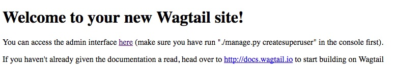
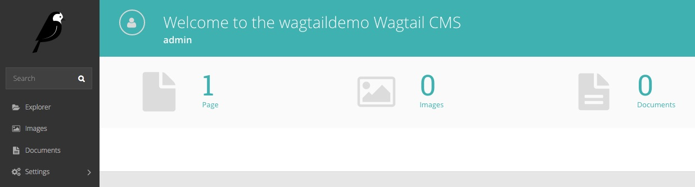

# Wagtail CMS for OpenShift 3

[Wagtail CMS](https://wagtail.io) is an Open Source, content management system implemented using the Python Django web framework.

This project repository contains all the files you need to deploy a Wagtail CMS instance to OpenShift 3. This includes deployment of a database and the initialisation of that database for the Wagtail CMS application.

Step by step deployment instructions for OpenShift 3 are provided, as well as templates, to provide an instantly deployable application. In addition, step by step instructions are provided for running this Wagtail CMS demo application in a local development environment using ``warpdrive``, as well as under Docker.

The reasons for developing this project is as a case study for how a complex web application, requiring persistent storage, a database, and other services, can be deployed to OpenShift.

## Deployment Instructions

Deployment instructions are provided for the following scenarios.

* [Running in a local environment](docs/running-in-a-local-environment.md)
* [Deploying to a Docker service](docs/deploying-to-a-docker-service.md)
* [Deploying to an OpenShift cluster](docs/deploying-to-an-openshift-cluster.md)

